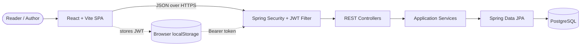

# Blog Platform

A full-stack blogging application with a Spring Boot REST API, a React/Vite client, PostgreSQL persistence, JWT authentication, Docker-based local database tooling, and Azure infrastructure defined with Terraform.

## What the application supports

- Public browsing of published posts, categories, and tags
- Filtering published posts by category and/or tag
- JWT-authenticated post creation, editing, deletion, and draft management
- Authenticated category and tag administration
- Rich-text post editing with TipTap
- Light and dark themes
- Estimated reading time (200 words per minute)

## Repository layout

```text
.
|-- backend/blog/          Spring Boot 3.4 / Java 21 API
|-- frontend/              React 18 / TypeScript / Vite client
|-- infra/                 Azure Terraform configuration
|-- docs/                  API, architecture, ERD, and operations docs
`-- .github/workflows/     Deployment examples (currently stored as .txt)
```

## Architecture at a glance



The backend uses controllers for HTTP concerns, services for business rules, repositories for persistence, MapStruct for entity/DTO conversion, and JPA entities for the data model. See [docs/architecture.md](docs/architecture.md) for request flows and design details.

## Prerequisites

- Java 21
- Node.js 20+ and npm
- Docker Desktop or another Docker Compose implementation
- Optional for cloud deployment: Terraform and Azure CLI

## Local development

### 1. Start PostgreSQL

From the repository root:

```bash
cd backend/blog
docker compose up -d
```

This starts PostgreSQL on `localhost:5432` and Adminer on <http://localhost:8888>. The development database name is `postgres`, the username is `postgres`, and the checked-in development password is `changemeinprod!`. These values are local-development defaults only.

### 2. Start the backend

From `backend/blog`:

```bash
# macOS/Linux
./mvnw spring-boot:run

# Windows PowerShell
.\mvnw.cmd spring-boot:run
```

The API listens on `http://localhost:8080` and uses the `dev` Spring profile by default. Hibernate creates or updates the schema automatically.

### 3. Start the frontend

From `frontend`:

```bash
npm install
npm run dev
```

Vite prints the client URL, normally `http://localhost:5173`.

Important: the current client has a production API URL hard-coded in `src/services/apiService.ts`. The Vite proxy is configured for `/api`, but the API service does not currently use it. To run fully against a local backend, change `baseURL` in that file to `http://localhost:8080/api/v1`. `VITE_API_BASE_URL` is not yet wired into the application.

## Authentication

At backend startup, the application creates a development user when it does not already exist:

```text
Email:    user@test.com
Password: password
```

`POST /api/v1/auth/login` returns a JWT valid for 24 hours. The frontend stores it in `localStorage` and sends it as `Authorization: Bearer <token>`.

Do not expose the default account or development JWT/database secrets in a public environment. Production must provide `JWT_SECRET`, `SPRING_DATASOURCE_URL`, `SPRING_DATASOURCE_USERNAME`, and `SPRING_DATASOURCE_PASSWORD`.

## Build and test

Backend:

```bash
cd backend/blog
./mvnw test
./mvnw clean package
```

Frontend:

```bash
cd frontend
npm run lint
npm run build
npm run preview
```

The backend currently contains only a Spring context smoke test. The frontend currently has no automated test runner. See [CONTRIBUTING.md](CONTRIBUTING.md) for the recommended verification checklist.

## Configuration

| Setting | Used by | Purpose |
|---|---|---|
| `SPRING_PROFILES_ACTIVE` | Backend | Selects the Spring profile; defaults to `dev` |
| `SPRING_DATASOURCE_URL` | Backend prod profile | PostgreSQL JDBC URL |
| `SPRING_DATASOURCE_USERNAME` | Backend prod profile | Database username |
| `SPRING_DATASOURCE_PASSWORD` | Backend prod profile | Database password |
| `JWT_SECRET` | Backend prod profile | HMAC signing key; use at least 32 bytes |

## Documentation

- [API reference](docs/API.md)
- [Architecture and request flows](docs/architecture.md)
- [Entity relationship model](docs/ERD.md)
- [Complete data model](docs/data-model.md)
- [Diagram catalog and roadmap](docs/diagram-catalog.md)
- [Application behavior and user guide](docs/application-guide.md)
- [Deployment models and release operations](docs/deployment.md)
- [Azure/Terraform guide](docs/terraform-readme.md)
- [Frontend guide](frontend/README.md)
- [Contributing and verification](CONTRIBUTING.md)

## Known limitations

- There is no registration, password reset, or user-profile endpoint.
- Authorization is authentication-wide: authenticated users can currently modify any post, not only their own.
- Category editing exists in the client API but has no matching backend endpoint.
- Pagination and sorting controls are present in the UI, but post endpoints return plain lists and ignore pagination/sort parameters.
- CORS origins are hard-coded in two backend configuration classes and do not include localhost.
- The deployment workflow examples use a `.txt` extension, so GitHub Actions will not execute them unless they are moved to `.github/workflows/*.yml`.
- Terraform opens PostgreSQL to all IPv4 addresses and should be tightened before production use.

## License

The frontend includes an MIT license at `frontend/LICENSE`. Add a repository-root license if the intent is to license the entire project under the same terms.
