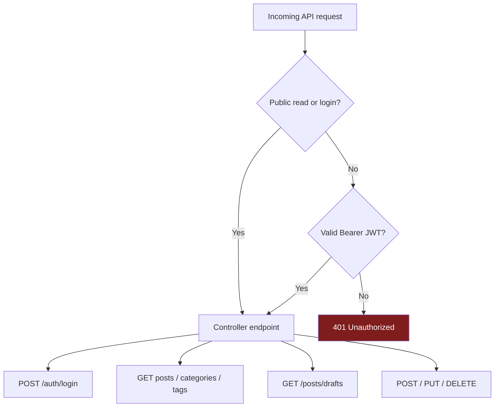
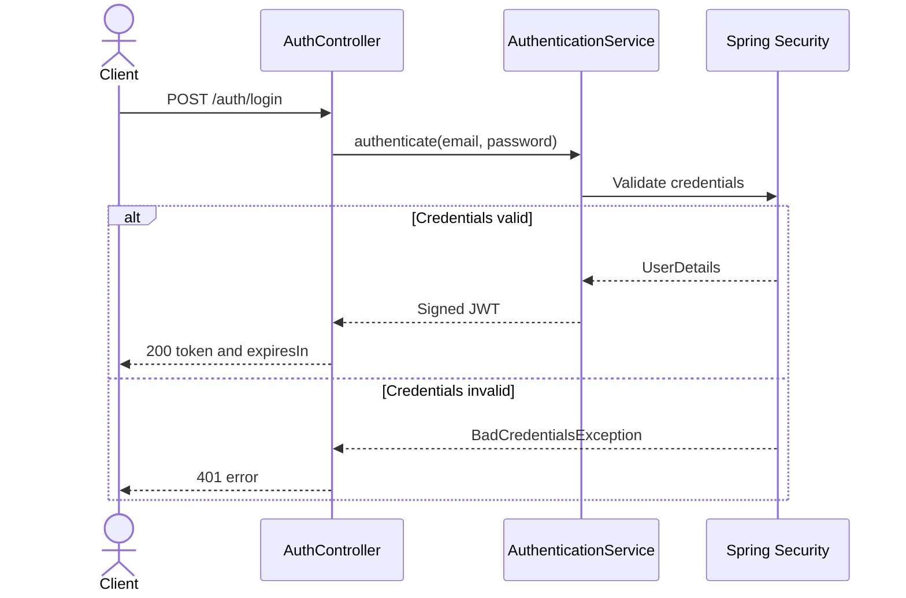

# REST API reference

Base path: `/api/v1`

Requests and responses use JSON. Protected endpoints require:

```http
Authorization: Bearer <jwt>
Content-Type: application/json
```

## Access rules



| Method and path | Access | Notes |
|---|---|---|
| `POST /auth/login` | Public | Returns a 24-hour JWT |
| `GET /posts` | Public | Published posts only |
| `GET /posts/{id}` | Public | Returns any matching post by ID, including a draft if its ID is known |
| `GET /posts/drafts` | Authenticated | Drafts owned by the authenticated user |
| `POST /posts` | Authenticated | Author is taken from the JWT |
| `PUT /posts/{id}` | Authenticated | No ownership check is currently enforced |
| `DELETE /posts/{id}` | Authenticated | No ownership check is currently enforced |
| `GET /categories` | Public | Includes published post counts |
| `POST /categories` | Authenticated | Names are unique, case-insensitively |
| `DELETE /categories/{id}` | Authenticated | Category must have no associated posts |
| `GET /tags` | Public | Includes published post counts |
| `POST /tags` | Authenticated | Creates multiple tags |
| `DELETE /tags/{id}` | Authenticated | Tag must have no associated posts |

## Authentication

### Login

`POST /auth/login`

```json
{
  "email": "user@test.com",
  "password": "password"
}
```

Success (`200 OK`):

```json
{
  "token": "<jwt>",
  "expiresIn": 86400
}
```

Invalid credentials return `401 Unauthorized`.



## Posts

### List published posts

`GET /posts?categoryId=<uuid>&tagId=<uuid>`

Both query parameters are optional and can be combined. The response is a JSON array; server-side pagination and sorting are not implemented.

### Get a post

`GET /posts/{id}`

Success (`200 OK`) returns a `Post` object. A missing ID returns `404 Not Found`.

### List the current user's drafts

`GET /posts/drafts`

Requires a valid JWT. The response is an array of draft posts whose author matches the authenticated user. Pagination parameters sent by the current frontend are ignored.

### Create a post

`POST /posts`

```json
{
  "title": "A documented post",
  "content": "<p>Post content with enough characters.</p>",
  "categoryId": "00000000-0000-0000-0000-000000000000",
  "tagIds": ["00000000-0000-0000-0000-000000000001"],
  "status": "PUBLISHED"
}
```

Success: `201 Created`. Valid statuses are `DRAFT` and `PUBLISHED`. The backend calculates `readingTime`, assigns the authenticated author, and verifies that the category and every tag exist.

Note: the create controller currently omits `@Valid`, so DTO validation annotations are not enforced on this endpoint.

### Update a post

`PUT /posts/{id}`

```json
{
  "id": "00000000-0000-0000-0000-000000000010",
  "title": "Updated title",
  "content": "<p>Updated post content.</p>",
  "categoryId": "00000000-0000-0000-0000-000000000000",
  "tagIds": [],
  "status": "DRAFT"
}
```

Success: `200 OK`. The path ID selects the post; the body `id` is validated as present but is not used by the service.

### Delete a post

`DELETE /posts/{id}`

Success: `204 No Content`.

## Categories

### List categories

`GET /categories`

```json
[
  {
    "id": "00000000-0000-0000-0000-000000000000",
    "name": "Engineering",
    "postCount": 3
  }
]
```

`postCount` counts published posts only.

### Create a category

`POST /categories`

```json
{ "name": "Engineering" }
```

Names must contain 2-50 letters, digits, spaces, underscores, or hyphens. Success: `201 Created`.

### Delete a category

`DELETE /categories/{id}`

Success: `204 No Content`. If the category has posts, the API returns `400 Bad Request`. Deleting a nonexistent category currently also returns `204`.

There is no backend category-update endpoint, despite the frontend exposing an `updateCategory` method.

## Tags

### List tags

`GET /tags` returns tag objects with published `postCount` values.

### Create tags

`POST /tags`

```json
{ "names": ["java", "spring-boot"] }
```

The request accepts at most 10 tag names, each 2-30 characters. Success: `201 Created`.

Implementation caveat: newly created tags are saved but are not currently added to the returned list; a follow-up `GET /tags` is required to retrieve them.

### Delete a tag

`DELETE /tags/{id}`

Success: `204 No Content`. A tag with associated posts returns `409 Conflict`. A nonexistent tag currently returns `204`.

## Shared response models

```json
{
  "id": "uuid",
  "title": "string",
  "content": "string",
  "author": { "id": "uuid", "name": "string" },
  "category": { "id": "uuid", "name": "string", "postCount": 0 },
  "tags": [{ "id": "uuid", "name": "string", "postCount": 0 }],
  "readingTime": 1,
  "createdAt": "2026-01-01T12:00:00",
  "updatedAt": "2026-01-01T12:00:00",
  "status": "PUBLISHED"
}
```

Errors use this shape:

```json
{
  "status": 404,
  "message": "Post with id ... not found",
  "errors": null
}
```

Known statuses are `400`, `401`, `404`, `409`, and `500`. Field-level validation errors are modeled but there is no dedicated validation exception handler yet, so actual validation failures may use Spring's default response or the generic `500` handler.
