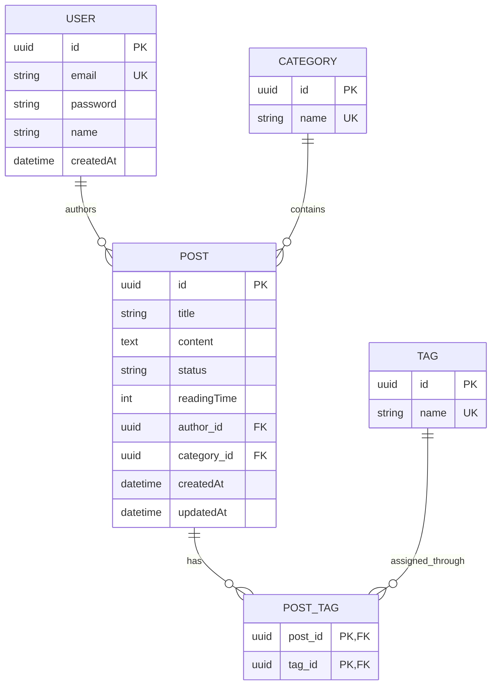

# Entity Relationship Diagram (ERD)

This diagram reflects the JPA entities currently implemented by the backend.

For conceptual, physical, lifecycle, and DTO-mapping views, see the complete [data model guide](data-model.md).

The existing [PNG diagram](images/blog-platform-erd.png) is a legacy artifact and does **not** match the current JPA model: it includes comments and a post/category join table, and omits the current tag relationship. Use the Mermaid diagram above as the source of truth until the PNG is regenerated.

## Entities and Relationships

- **User**: Can author multiple posts.
- **Post**: Belongs to one category and can have multiple tags.
- **Category**: Can contain multiple posts.
- **Tag**: Can be associated with multiple posts.

## Diagram Details

- **User** to **Post**: One-to-Many (A user can write many posts).
- **Post** to **Category**: Many-to-One (Each post belongs to one category).
- **Post** to **Tag**: Many-to-Many (Posts can have multiple tags, and tags can be associated with multiple posts).

## Persistence details

- Primary keys are generated UUIDs.
- `Post.author_id` and `Post.category_id` are required foreign keys.
- The many-to-many relationship is stored in `post_tags(post_id, tag_id)`.
- Category and tag names are unique at the database level.
- User email is unique.
- Posts store `DRAFT` or `PUBLISHED`, calculated reading time, and created/updated timestamps.
- Users store a created timestamp; passwords are encoded with Spring Security's delegating password encoder.
