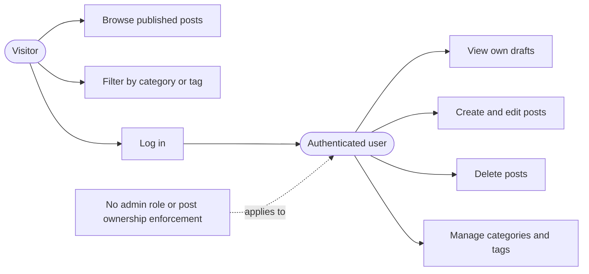
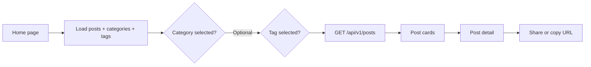
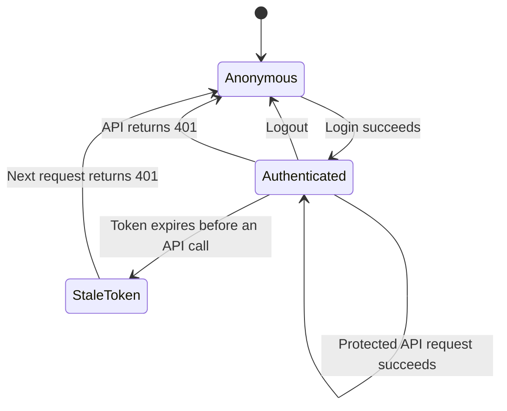

# Application guide

This guide explains how the Blog Platform behaves from a reader's, author's, and operator's perspective. For installation commands, start with the repository [README](../README.md).

## Application roles

The current application has two effective access levels:

A visitor can read published content and inspect categories and tags. A user with a valid JWT can access every mutation endpoint. Although the UI presents these actions as authoring tools, the backend does not currently restrict post updates or deletion to the post's author.

## Reader journey

1. Open `/` to load published posts, categories, and tags in parallel.
2. Select a category tab, a tag, or both to filter the server query.
3. Select a post card to open `/posts/{id}`.
4. Use the browser's native share feature when available; the application otherwise copies the URL.

Only posts returned by the published-post list queries appear on the home page. However, `GET /posts/{id}` does not filter by status, so a draft is publicly retrievable if its UUID is known.

## Author journey

### Sign in

Open `/login` and submit credentials. The development account is `user@test.com` / `password`. A successful response stores the JWT in browser `localStorage` for subsequent requests.

### Create a post

1. Select **New Post**.
2. Enter a title and rich-text content.
3. Choose a required category and up to ten tags.
4. Choose `DRAFT` or `PUBLISHED`.
5. Submit the form.

The backend assigns the authenticated user, resolves the category and tags, calculates reading time at 200 words per minute, and sets timestamps through JPA lifecycle callbacks.

### Work with drafts

`/posts/drafts` lists draft posts for the authenticated user. The UI displays pagination and sorting controls, but the current API returns an unpaginated list and ignores those parameters.

### Edit and delete

Authenticated users see edit and delete controls on post detail pages. Updates replace the title, content, status, category, and full tag set. Deletion permanently removes the post.

## Category and tag administration

| Operation | Category | Tag |
|---|---|---|
| List | Public | Public |
| Create | Authenticated | Authenticated, bulk request |
| Update | UI attempts it, backend route missing | Not implemented |
| Delete | Authenticated; category must be unused | Authenticated; tag must be unused |

Category and tag counts include published posts only. The frontend disables deletion when a displayed count is nonzero, and the backend applies its own association check.

## Content behavior

The editor produces HTML using TipTap. Post displays sanitize that HTML with DOMPurify. The current display allowlist includes paragraphs, bold, italic, and line breaks. Headings and lists can be created in the editor but are stripped during display, so editor and renderer capabilities are not yet aligned.

## Authentication lifecycle

On page refresh, the client treats any stored token as authenticated without validating it. A stale or invalid token is cleared only when an API request returns `401`.

## Common application limitations

- No registration, profile, password-reset, or account-management screens
- No administrator role
- No backend post-ownership authorization
- No comments, media upload, search, or scheduled publishing
- No real server-side pagination or sorting
- No optimistic updates or offline behavior
- No automated frontend test suite
- Limited rich-text rendering allowlist

For endpoint details, see [API.md](API.md). For component and request flows, see [architecture.md](architecture.md).
