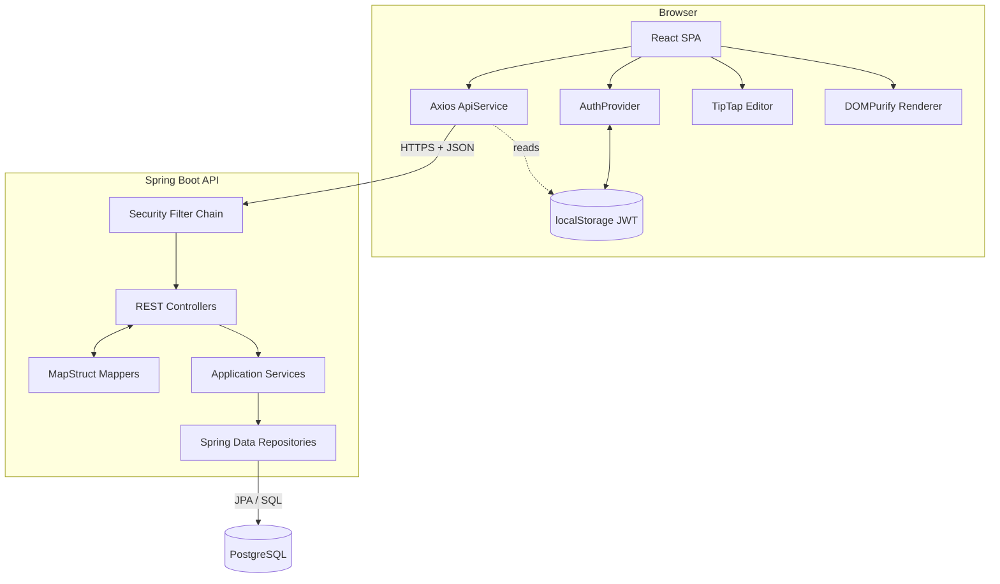
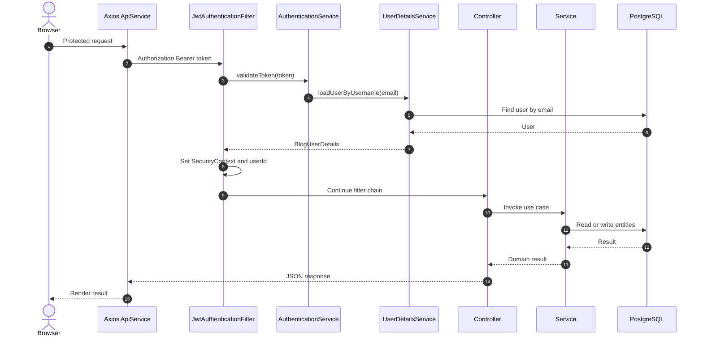
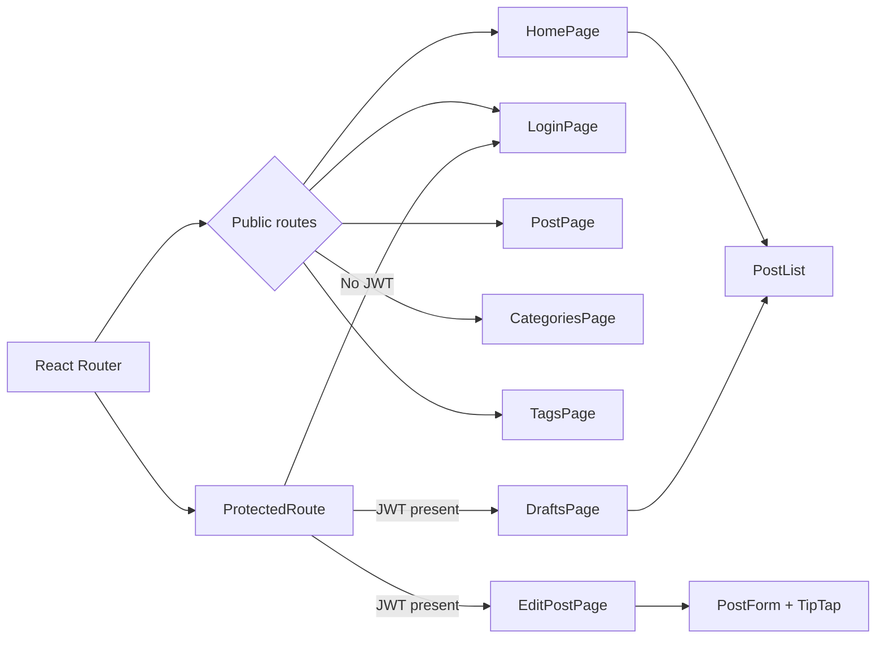
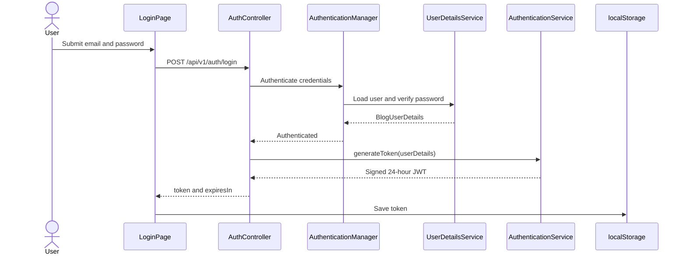
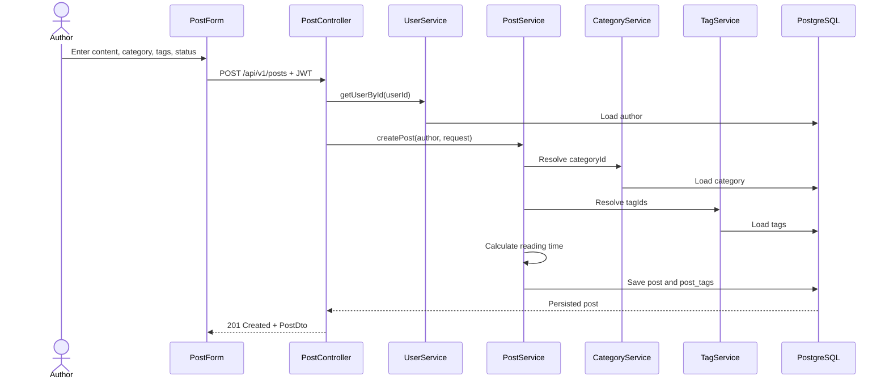
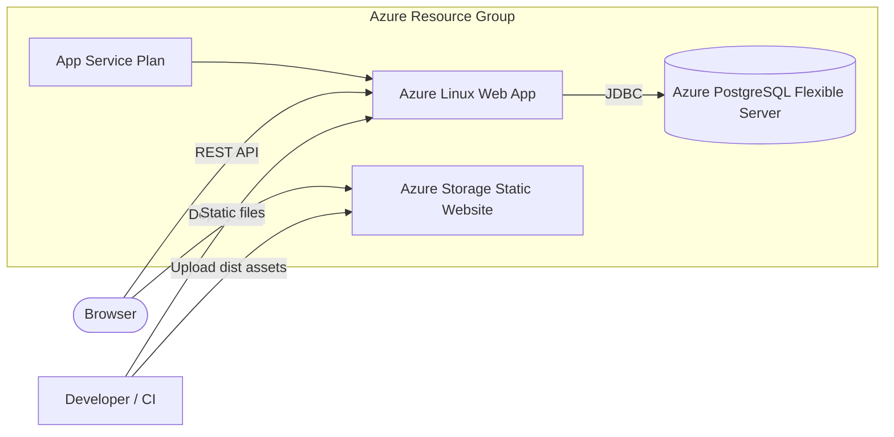

# Architecture

## System context

The project is a browser-based blog with a React single-page application, a stateless Spring Boot API, and PostgreSQL. The browser calls the API directly. Azure resources and static frontend upload are represented in `infra/`.



## Backend modules

- `config/`: Spring Security and CORS configuration.
- `controllers/`: HTTP routes and DTO conversion.
- `domain/dtos/`: external request/response contracts.
- `domain/entities/`: JPA persistence model.
- `mappers/`: MapStruct mappings and published-post counts.
- `repositories/`: Spring Data query interfaces.
- `security/`: user-details adapter and JWT request filter.
- `services/`: business interfaces and implementations.

### Request lifecycle

For a protected request, `JwtAuthenticationFilter` reads a Bearer token, asks `AuthenticationService` to parse it, loads the user by email, places authentication in the security context, and adds the user's UUID as the `userId` request attribute. Controllers use that attribute when ownership context is needed, currently for creating posts and listing drafts.

Controllers call services with domain request objects. Services resolve related entities, apply rules, and call repositories. MapStruct converts entities to API DTOs. `ErrorController` translates common exceptions into API errors.



### Security model

- The API is stateless and CSRF is disabled.
- Login, public post reads, category reads, and tag reads are anonymous.
- All other routes require authentication.
- JWTs are HMAC-SHA256 signed and expire after 24 hours.
- Every authenticated user receives `ROLE_USER`; there is no admin role or per-resource authorization.
- A default user is seeded during `UserDetailsService` bean creation.

Two independent CORS configurations contain the same hard-coded production origins. Consolidating these into one environment-driven configuration would reduce drift and enable localhost development.

## Frontend modules and routes

`AuthProvider` owns the token and coarse authenticated state. `apiService` is a singleton Axios wrapper that adds the JWT and redirects to `/login` after a `401`.

| Route | Component | Access |
|---|---|---|
| `/` | `HomePage` | Public |
| `/login` | `LoginPage` | Public |
| `/posts/new` | `EditPostPage` | Protected in the client |
| `/posts/:id` | `PostPage` | Public |
| `/posts/:id/edit` | `EditPostPage` | Protected in the client |
| `/categories` | `CategoriesPage` | Public; mutations shown when authenticated |
| `/tags` | `TagsPage` | Public; mutations shown when authenticated |
| `/posts/drafts` | `DraftsPage` | Protected in the client and API |

The editor stores TipTap-generated HTML in the post content field. Display components sanitize it with DOMPurify, currently allowing only `p`, `strong`, `em`, and `br`; headings and lists produced by the editor are therefore stripped when rendered.



## Data model

- A `User` authors many `Post` records.
- A `Category` contains many posts; each post requires one category.
- `Post` and `Tag` have a many-to-many relationship through `post_tags`.
- `Post.status` is `DRAFT` or `PUBLISHED`.
- Entity lifecycle callbacks maintain created/updated timestamps.

See [data-model.md](data-model.md) for conceptual, physical, lifecycle, and DTO-mapping diagrams, or [ERD.md](ERD.md) for the compact relationship reference.

## Key flows

### Login

1. The client posts credentials to `/auth/login`.
2. Spring's authentication manager validates them against the database and password encoder.
3. The service signs a JWT whose subject is the email.
4. The client stores the token in `localStorage`.



### Create post

1. The client submits rich-text HTML, category ID, tag IDs, and status.
2. The JWT filter exposes the authenticated user ID.
3. The service loads the user/category/tags and calculates reading time.
4. JPA persists the post and join-table rows.



### Public listing

1. The client requests posts plus optional category/tag IDs.
2. The service selects one of four repository queries.
3. All queries constrain status to `PUBLISHED`.
4. Mappers construct nested author/category/tag DTOs.

## Runtime configuration

The default Spring profile is `dev`. It points to local PostgreSQL and enables SQL logging. The `prod` profile reads database credentials and the JWT secret from environment variables.

The frontend currently uses a hard-coded Render API URL. Although Vite defines a proxy, the Axios base URL bypasses it. An intended improvement is:

```ts
const baseURL = import.meta.env.VITE_API_BASE_URL ?? '/api/v1';
```

## Deployment

Terraform provisions a resource group, PostgreSQL Flexible Server, Linux App Service plan and backend Web App, and a storage-account static website for the built frontend. See [terraform-readme.md](terraform-readme.md) for exact inputs and warnings.



## Architectural risks and recommended next work

1. Add post ownership/role authorization to update and delete operations.
2. Prevent public retrieval of drafts by ID.
3. Replace hard-coded API URLs, CORS origins, and seeded credentials with environment configuration.
4. Implement pagination/sorting contracts shared by backend and frontend.
5. Add a user-profile endpoint so the client can validate tokens and display the signed-in user.
6. Add database migrations (Flyway or Liquibase) instead of production `ddl-auto=update`.
7. Add service/controller tests and frontend component/integration tests.
8. Consolidate error handling, especially bean-validation failures.
