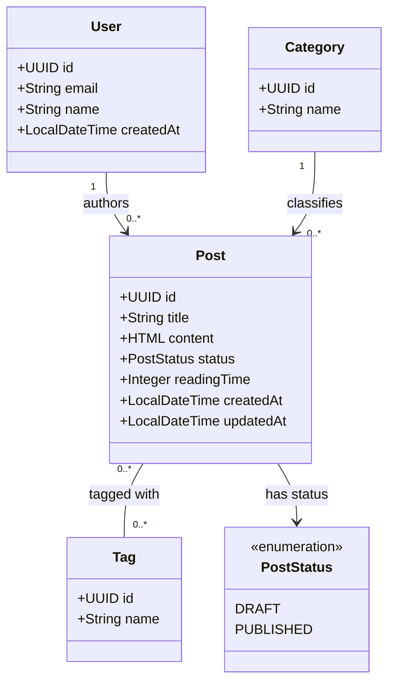
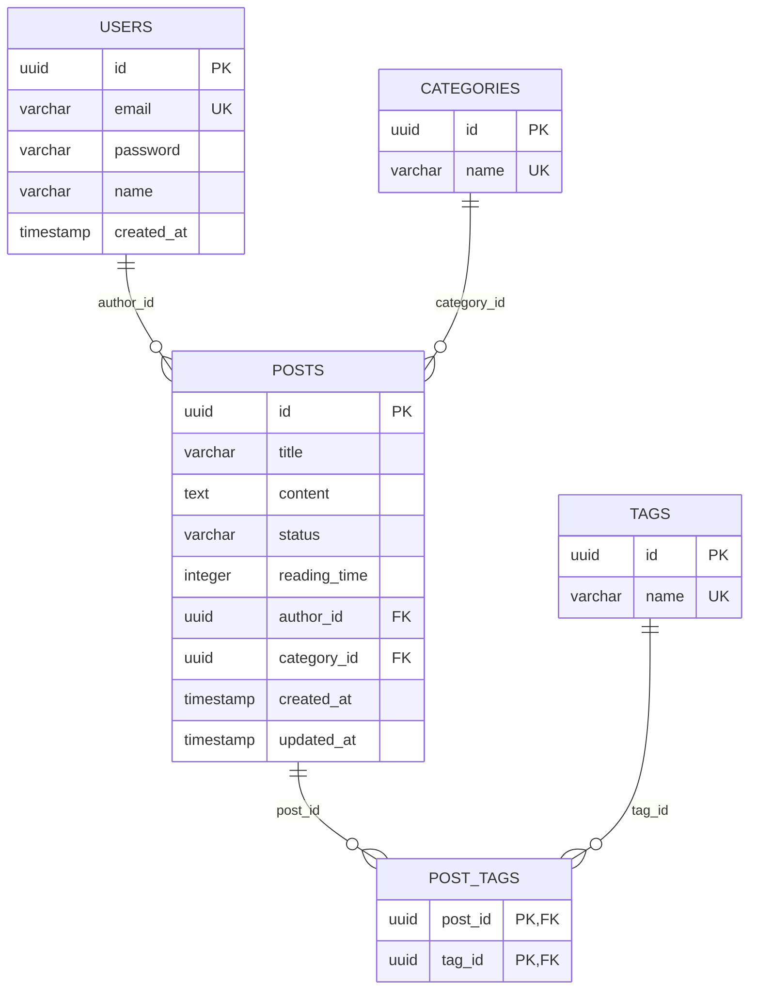
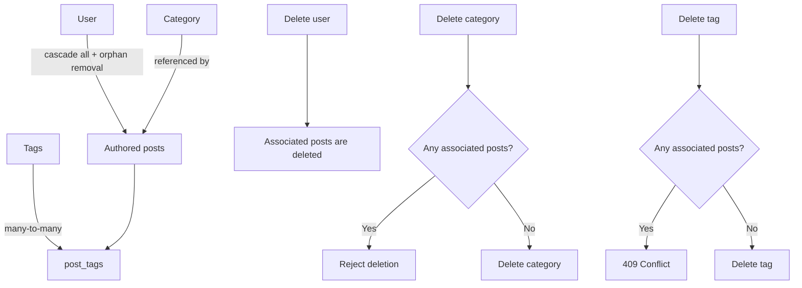
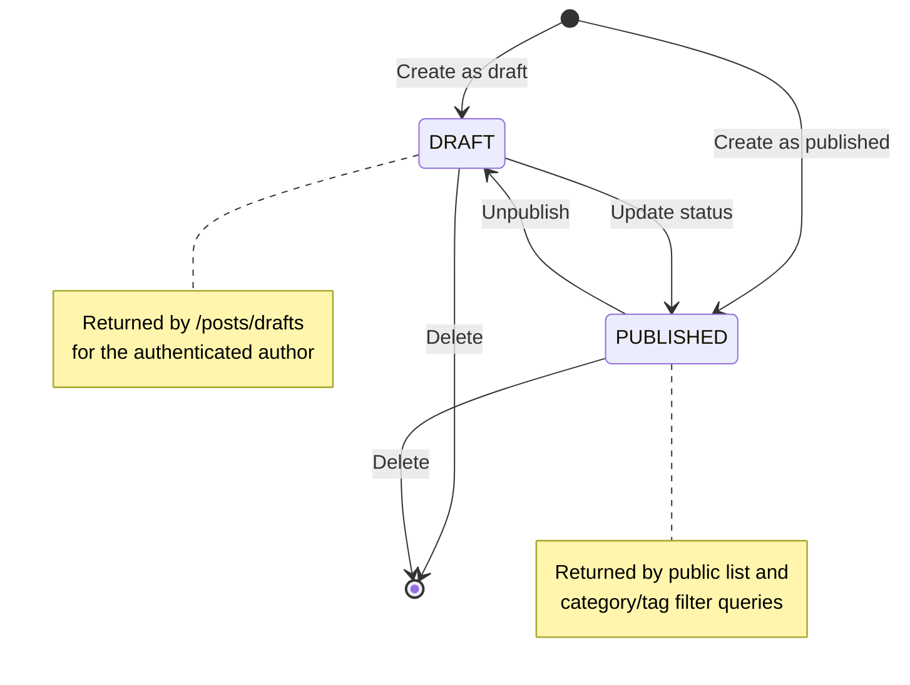
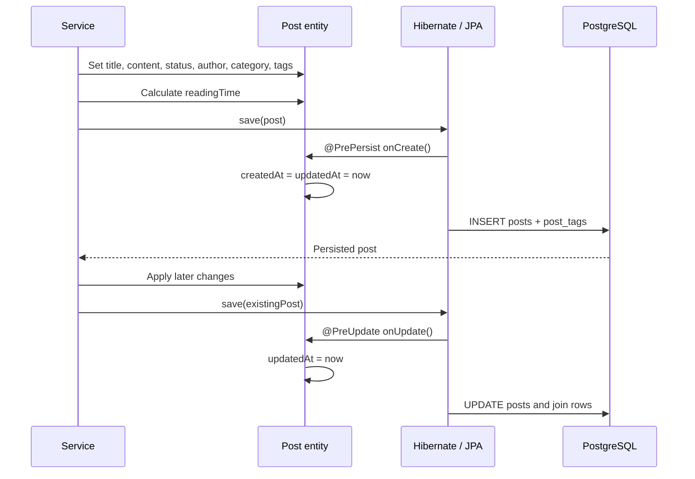
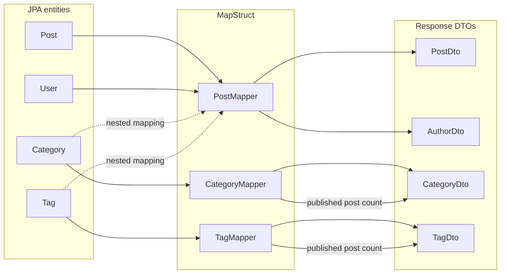
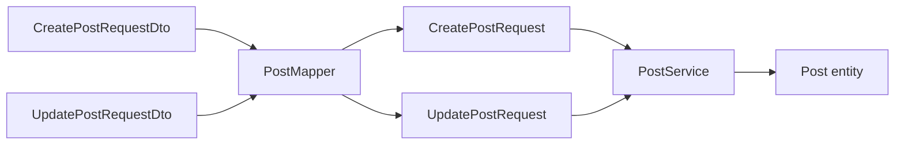

# Data model

This document describes the Blog Platform's data from four perspectives: domain concepts, physical PostgreSQL tables, entity lifecycle, and API representation. The implementation source of truth is the JPA model under `backend/blog/src/main/java/me/nayanm/blog/domain/entities`.

## Conceptual domain model

This view focuses on business meaning rather than columns or join tables.

Key rules:

- Every post requires one author and one category.
- A post can have zero or more tags.
- A user can author any number of posts.
- A category or tag can exist without posts.
- Post status is either `DRAFT` or `PUBLISHED`.

## Physical database model

The `post_tags` table implements the many-to-many post/tag relationship. It is created by JPA from `Post.tags` and is not represented by a Java entity.

## Ownership and deletion behavior

The category and tag guards are application-service rules. The current category service returns success without deletion when the ID does not exist; the tag service behaves similarly.

## Post lifecycle

The status enum has two values and no review, archived, or scheduled state.

`GET /posts/{id}` loads by ID without checking status, so both states are currently retrievable through that public route if the UUID is known.

## Persistence lifecycle

## Entity-to-API mapping

Entities remain inside the backend. Controllers expose DTOs generated through MapStruct.

`PostDto` contains nested author, category, and tag representations. Passwords and the user's email are not included in post responses.

## Request models

The create and update models carry title, content, category ID, tag IDs, and status. The update DTO also requires an `id`, although the service selects the post using the route ID.

## Integrity and schema-management notes

- UUID primary keys are generated by Hibernate.
- Email, category name, and tag name are unique database columns.
- Entity relationships require author and category foreign keys.
- `post_tags` uses a composite primary key of `(post_id, tag_id)`.
- Production currently uses `spring.jpa.hibernate.ddl-auto=update`.
- There are no versioned Flyway or Liquibase migrations.
- `Post.equals` and `hashCode` use mutable content and timestamps, which can make entity identity behavior surprising in sets or persistence contexts.
- Category and tag uniqueness handling differs: category creation checks case-insensitively, while tag lookup uses the submitted names directly.

See [ERD.md](ERD.md) for the compact relationship reference and [API.md](API.md) for serialized response shapes.
