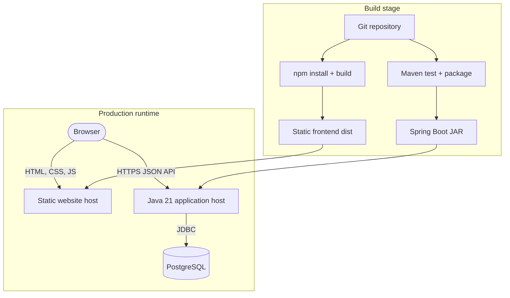
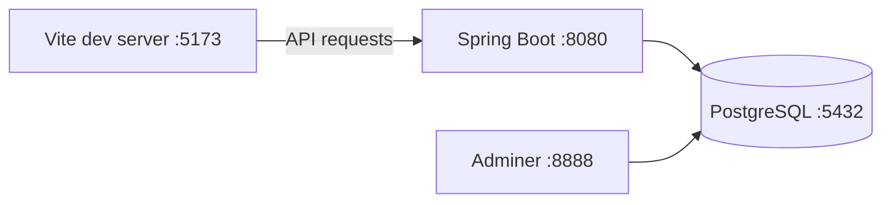
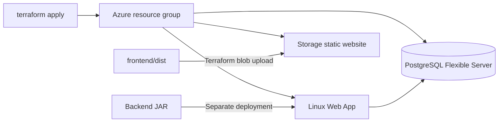
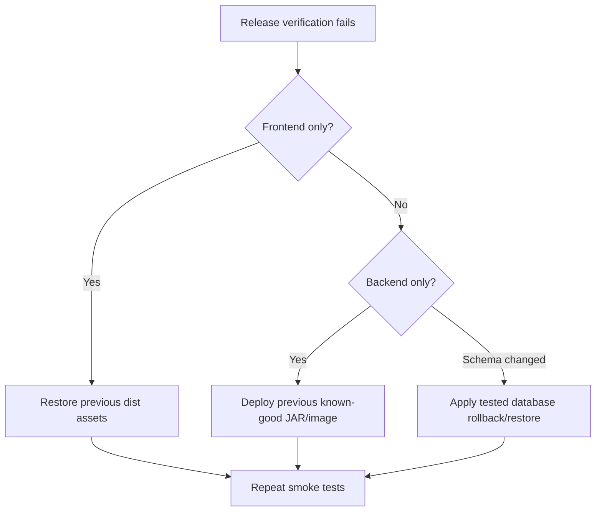

# Application deployment guide

The repository currently contains three deployment models: local development, a backend URL hosted on Render that is hard-coded into the frontend, and Azure infrastructure defined with Terraform. Azure workflow examples exist, but they use `.txt` extensions and are therefore documentation rather than active GitHub Actions workflows.

## Deployment topology



## Environment matrix

| Concern | Local development | Current frontend setting | Azure Terraform target |
|---|---|---|---|
| Frontend | Vite dev server | Static client can be hosted anywhere | Azure Storage static website |
| Backend | Spring Boot on port 8080 | Render URL in `apiService.ts` | Azure Linux Web App |
| Database | Docker PostgreSQL on 5432 | Host-specific PostgreSQL | Azure PostgreSQL Flexible Server |
| Backend profile | `dev` | Expected `prod` remotely | Terraform sets `prod` |
| Secrets | Checked-in development defaults | Host environment | Azure Web App settings |

## Build artifacts

### Backend

```bash
cd backend/blog
./mvnw test
./mvnw clean package
```

Windows PowerShell:

```powershell
cd backend/blog
.\mvnw.cmd test
.\mvnw.cmd clean package
```

The deployable artifact is `backend/blog/target/blog-0.0.1-SNAPSHOT.jar`. The Dockerfile expects that exact file to exist before `docker build` runs.

### Frontend

```bash
cd frontend
npm ci
npm run lint
npm run build
```

The deployable artifact is the `frontend/dist/` directory. The build currently succeeds with a large JavaScript chunk warning. Frontend lint currently reports pre-existing TypeScript/ESLint issues and should be fixed before making lint a blocking deployment gate.

## Required production configuration

| Variable | Example form | Requirement |
|---|---|---|
| `SPRING_PROFILES_ACTIVE` | `prod` | Select production properties |
| `SPRING_DATASOURCE_URL` | `jdbc:postgresql://host:5432/postgres` | Reachable PostgreSQL JDBC URL |
| `SPRING_DATASOURCE_USERNAME` | `blogadmin` | Database login |
| `SPRING_DATASOURCE_PASSWORD` | secret | Store only in the platform secret manager |
| `JWT_SECRET` | random 32+ byte value | Stable across restarts; never commit |

The frontend does not currently read `VITE_API_BASE_URL`. Before deploying to a new API host, update `baseURL` in `frontend/src/services/apiService.ts` or implement environment-based configuration and rebuild the client.

## Deployment model A: local Docker database



1. Run `docker compose up -d` in `backend/blog`.
2. Start Spring Boot with the Maven wrapper.
3. Point the frontend API base URL to `http://localhost:8080/api/v1`.
4. Start Vite with `npm run dev`.

The hard-coded backend CORS allowlist does not include localhost. Local browser integration therefore requires adding the Vite origin or replacing the duplicate CORS configuration with environment-driven origins.

## Deployment model B: Render-compatible backend

The frontend currently calls `https://blog-app-latest-1.onrender.com/api/v1`. To reproduce that model on a Java application host:

1. Provision a PostgreSQL database.
2. configure the five backend environment variables listed above;
3. build and deploy the Spring Boot JAR, or build the Dockerfile after packaging;
4. expose port `8080` or use the host's port mapping;
5. add the frontend origin to backend CORS;
6. update and rebuild the frontend if the API hostname changes.

The repository does not include a Render blueprint or service manifest, so Render configuration is currently maintained outside source control.

## Deployment model C: Azure with Terraform

Use [terraform-readme.md](terraform-readme.md) for resource-level commands and security warnings.



Terraform provisions the Web App but does not deploy the JAR. The backend workflow example can perform that step after it is renamed to `.yml` and its secrets are configured. The frontend workflow example uploads `dist/` to Azure Storage, but it is likewise inactive while stored as `.txt`.

## Activating GitHub Actions

The current examples are:

- `.github/workflows/azure-backend-deploy.txt`
- `.github/workflows/azure-frontend-deploy.txt`

To activate them, review all resource names and secrets, then rename them with `.yml` or `.yaml`. Required secrets include the Azure federated-login identifiers used by the backend workflow and `AZURE_STORAGE_CONNECTION_STRING` for the frontend workflow.

Do not activate the workflows unchanged until the API base URL, CORS origins, database firewall, and production credentials have been reviewed.

## Release verification

After deployment, verify:

1. The frontend entry point and client-side route fallback load successfully.
2. `POST /api/v1/auth/login` returns a JWT for an intended production account.
3. Public post, category, and tag endpoints return expected data.
4. Protected requests reject missing/invalid JWTs and accept a valid JWT.
5. Create a draft, list it, publish it, and delete test content.
6. Browser requests have no CORS or mixed-content errors.
7. Application logs contain no database/JWT configuration failures.
8. Database connectivity is restricted to required networks.

## Rollback model



The application currently uses Hibernate `ddl-auto=update` rather than versioned migrations. This makes database rollback unreliable. Introduce Flyway or Liquibase and take verified backups before production schema changes.

## Production-readiness checklist

- Replace the seeded development user and checked-in development secrets
- Add post ownership or role-based authorization
- Prevent anonymous access to draft posts by ID
- Restrict PostgreSQL firewall rules
- Configure a remote, protected Terraform state backend
- Use environment-driven API URLs and CORS origins
- Enable TLS-only access and platform health checks
- Add structured logging, monitoring, alerting, and backups
- Add database migrations
- Fix frontend lint and add meaningful automated test coverage
- Rename and validate deployment workflows before activation
