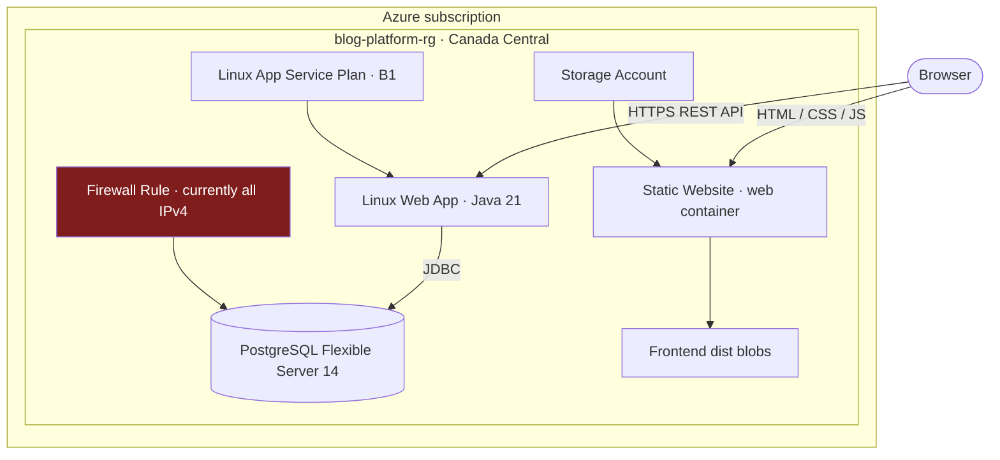
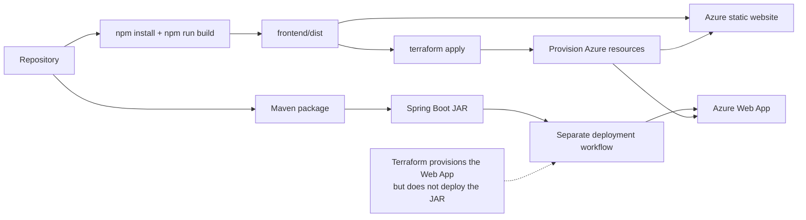

# Azure infrastructure with Terraform

The `infra/` configuration provisions the Azure resources used by the blog platform and uploads a prebuilt frontend to Azure Storage static website hosting.

## Resources



| Resource | Terraform name | Purpose |
|---|---|---|
| Resource group | `azurerm_resource_group.rg` | Groups all blog resources in Canada Central |
| PostgreSQL Flexible Server 14 | `azurerm_postgresql_flexible_server.db` | Application database |
| PostgreSQL firewall rule | `azurerm_postgresql_flexible_server_firewall_rule.allow_all` | Currently permits all IPv4 addresses |
| Linux App Service plan | `azurerm_service_plan.plan` | B1 compute plan |
| Linux Web App | `azurerm_linux_web_app.backend` | Java 21 backend |
| Storage account | `azurerm_storage_account.frontend` | Hosts frontend assets |
| Static website configuration | `azurerm_storage_account_static_website.frontend_static` | SPA entry and fallback document |
| Storage blobs | `azurerm_storage_blob.frontend_build` | Uploads files from `frontend/dist` |

## Prerequisites

- Terraform
- Azure CLI authenticated with `az login`
- An Azure subscription and permission to create the resources above
- A completed frontend build in `frontend/dist`

## Inputs

| Variable | Sensitive | Description |
|---|---:|---|
| `subscription_id` | No | Azure subscription ID |
| `db_username` | No | PostgreSQL administrator login |
| `db_password` | Yes | PostgreSQL administrator password |
| `jwt_secret` | Yes | Backend JWT signing secret, at least 32 bytes |
| `vite_api_base_url` | No | Declared but currently unused by the Terraform resources/client build |
| `mime_types` | No | Extension-to-content-type map with defaults |

Create an uncommitted `infra/terraform.tfvars`:

```hcl
subscription_id   = "00000000-0000-0000-0000-000000000000"
db_username       = "blogadmin"
db_password       = "replace-with-a-strong-password"
jwt_secret        = "replace-with-at-least-32-random-bytes"
vite_api_base_url = "https://example-backend/api/v1"
```

Confirm `terraform.tfvars` and state files are excluded from version control before adding real credentials.

## Deploy

Build the frontend first because `main.tf` evaluates files in `frontend/dist`:

```bash
cd frontend
npm install
npm run build

cd ../infra
terraform init
terraform fmt -check
terraform validate
terraform plan
terraform apply
```

After apply, Terraform outputs the backend hostname, PostgreSQL FQDN, and frontend static website endpoint.



## Backend application settings

Terraform configures:

- `SPRING_PROFILES_ACTIVE=prod`
- `SPRING_DATASOURCE_URL=jdbc:postgresql://<server>:5432/postgres`
- `SPRING_DATASOURCE_USERNAME`
- `SPRING_DATASOURCE_PASSWORD`
- `JWT_SECRET`

The Web App expects a deployable Spring Boot artifact to be delivered separately. Terraform creates the service but does not build or deploy the JAR.

## Important production concerns

- The database firewall currently spans `0.0.0.0` through `255.255.255.255`. Restrict it to the backend's actual network path before using real data.
- Resource names such as `blogplatformdb`, `blog-platform-api`, and `blogfrontend` are globally scoped in Azure and may collide. A random string resource exists but is not used in those names.
- The PostgreSQL server does not declare backup, private networking, high-availability, or lifecycle safeguards.
- Terraform state contains sensitive values. Use a secured remote backend with encryption and access controls for shared/production use.
- The frontend API URL is compiled in `apiService.ts`; the declared Terraform `vite_api_base_url` does not configure it.
- CORS settings in the backend must include the final frontend origin.

## Destroy

Review the plan carefully, then run from `infra/`:

```bash
terraform destroy
```

This deletes managed cloud resources and their data. Back up anything required before teardown.
